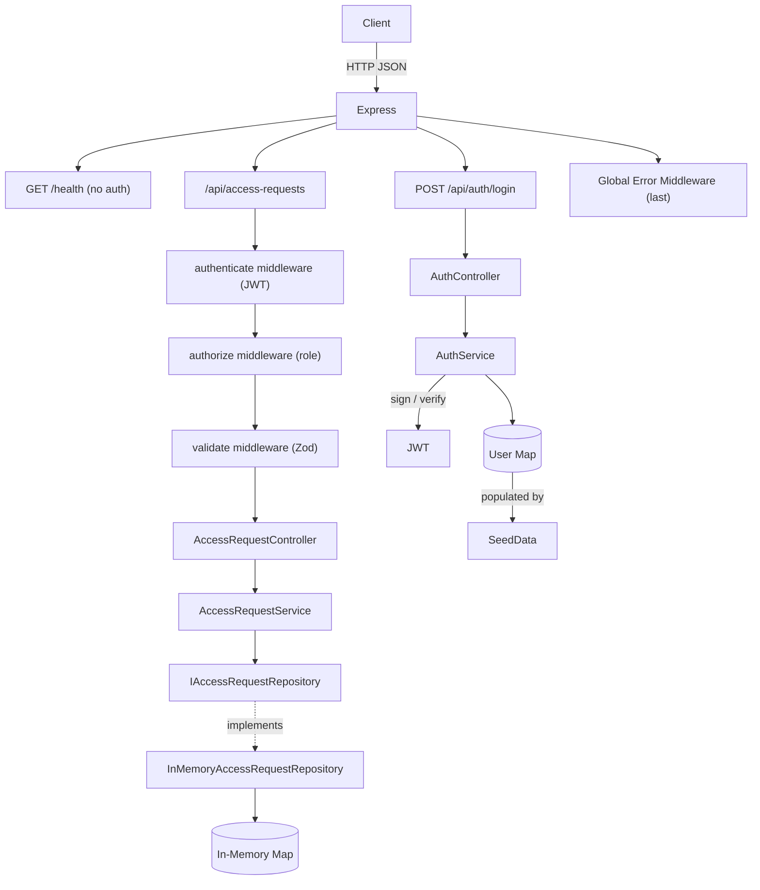

# monday-access-service

A production-grade REST API for managing internal application access requests.
Employees submit requests; approvers approve or deny them. All activity is tracked with full audit information.

---

## Architecture



---

## Project Structure

```
src/
├── config/               # Typed env config with fail-fast validation
├── models/               # Domain models, enums, interfaces (single source of truth)
├── repositories/         # IAccessRequestRepository + InMemoryAccessRequestRepository
├── services/             # Business logic: AuthService, AccessRequestService
├── controllers/          # HTTP layer only: AuthController, AccessRequestController
├── middleware/           # authenticate, authorize, validate, requestLogger, error
├── routes/               # Route factories (auth.routes, accessRequest.routes)
├── validators/           # Zod schemas for each endpoint
├── utils/                # AppError, winston logger
├── seed/                 # Mock users and requests — populates store at startup
├── types/                # Express module augmentation (req.user)
├── container.ts          # DI wiring — the only place `new` is called on services
├── app.ts                # Express app factory
└── index.ts              # Bootstrap: seed → listen
```

---

## Design Principles

| Principle | How it's applied |
|-----------|-----------------|
| **Single Responsibility** | Controllers = HTTP only. Services = business logic. Repositories = data access. |
| **Open/Closed** | `IAccessRequestRepository` interface — swap DB engine without touching service code. |
| **Dependency Inversion** | `AccessRequestService` depends on the interface, not the concrete class. |
| **Dependency Injection** | All dependencies injected via constructors, wired once in `container.ts`. |
| **Factory Pattern** | Middleware factories (`createAuthenticateMiddleware`, `createAuthorizeMiddleware`, `createValidateMiddleware`) close over injected dependencies. |
| **Repository Pattern** | Decouples storage from domain logic. |

---

## Data Model

```
AccessRequest {
  id                string    UUID v4
  applicationName   string    Target application
  justification     string    Business justification (10–1000 chars)
  status            enum      PENDING | APPROVED | DENIED

  // Audit
  createdBy         string    Requester user ID
  createdByEmail    string    Requester email (denormalized for display)
  createdAt         Date

  decisionBy?       string    Approver user ID
  decisionByEmail?  string
  decisionAt?       Date
  decisionNote?     string    Optional comment from approver
}
```

---

## Auth Flow

JWT-based authentication. On login a signed token is returned containing `sub` (user ID), `email`, `name`, and `role`.
All `/api/access-requests` endpoints require `Authorization: Bearer <token>`.

**Roles:**
- `EMPLOYEE` — create requests, view own requests
- `APPROVER` — view all requests, approve/deny PENDING requests

---

## Mock Users (Seed Data)

All users share the password: **`Password123!`**

| Name           | Email               | Role     |
|----------------|---------------------|----------|
| Alice Employee | alice@company.com   | EMPLOYEE |
| Bob Employee   | bob@company.com     | EMPLOYEE |
| Carol Approver | carol@company.com   | APPROVER |
| Dave Approver  | dave@company.com    | APPROVER |

Three seeded requests are pre-loaded (one PENDING, one APPROVED, one DENIED).

---

## Getting Started

### Prerequisites
- Node.js 20+, npm 10+

### Local Development

```bash
# 1. Install dependencies
npm install

# 2. Configure environment
cp .env.example .env
# Set JWT_SECRET to a strong random string

# 3. Start dev server (hot reload)
npm run dev
# → http://localhost:3000
```

### Production Build

```bash
npm run build
npm start
```

### Docker

```bash
# Build and run with docker-compose
docker-compose up --build

# Or manually
docker build -t monday-access-service .
docker run -p 3000:3000 -e JWT_SECRET=your-secret monday-access-service
```

---

## API Reference

### Health Check

```
GET /health
```
No authentication. Returns `{ "status": "ok" }`.

---

### Auth

#### Login
```
POST /api/auth/login
Content-Type: application/json

{ "email": "alice@company.com", "password": "Password123!" }
```
**Response:**
```json
{
  "data": {
    "token": "<jwt>",
    "user": { "id": "...", "email": "alice@company.com", "name": "Alice Employee", "role": "EMPLOYEE" }
  }
}
```

---

### Access Requests

All endpoints require `Authorization: Bearer <token>`.

#### Create a Request
```
POST /api/access-requests
```
Body: `{ "applicationName": "Salesforce", "justification": "Need for Q3 campaign management." }`
→ `201 Created`

#### Approve or Deny a Request *(APPROVER only)*
```
PATCH /api/access-requests/:id/decision
```
Body: `{ "decision": "APPROVED", "decisionNote": "Approved after security review." }`
→ `200 OK`

#### Get Requests by User
```
GET /api/access-requests/user/:userId
```
Employees can only retrieve their own (`userId` must match their token). Approvers can retrieve any user's.

#### Filter by Status *(APPROVER only)*
```
GET /api/access-requests/status/PENDING
GET /api/access-requests/status/APPROVED
GET /api/access-requests/status/DENIED
```

#### List All Requests *(APPROVER only)*
```
GET /api/access-requests
```

---

## Error Response Format

All errors follow a consistent envelope:

```json
{
  "error": {
    "message": "Human-readable description",
    "details": [{ "field": "justification", "message": "Must be at least 10 characters" }]
  }
}
```

| Status | Meaning |
|--------|---------|
| 400 | Validation error (invalid body or params) |
| 401 | Missing, malformed, or expired JWT |
| 403 | Insufficient role for the action |
| 404 | Resource not found |
| 409 | State conflict (e.g. deciding on a non-PENDING request) |
| 500 | Internal server error |

---

## Key Assumptions

1. **In-memory storage** — Data does not persist across restarts. The `IAccessRequestRepository` interface makes a database swap a focused, contained change.
2. **Mock users** — Users are seeded from `src/seed/index.ts`. In production this would be replaced by an identity provider (SSO/LDAP).
3. **Single instance** — No distributed state. A real multi-instance deployment would need a shared store (Redis, PostgreSQL, etc.).
4. **Stateless JWT** — Tokens are not revocable before expiry. A production system would use short-lived tokens with refresh, or a token denylist.
