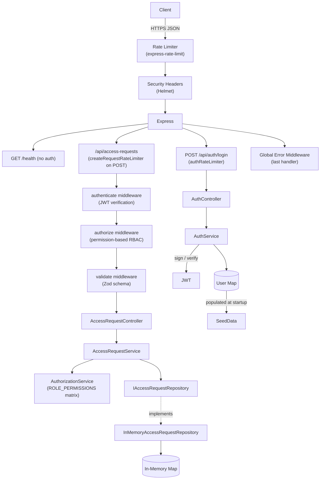

# monday-access-service

A production-grade REST API for managing internal application access requests.
Employees submit requests; approvers approve or deny them. All activity is captured with a full audit trail.

---

## Architecture



---

## Project Structure

```
src/
├── config/               # Typed env config with fail-fast validation
├── models/               # Domain models, enums, interfaces
│   ├── AccessRequest.ts  # Core domain types: AccessRequest, User, Role, TokenPayload
│   └── Permission.ts     # Permission enum + ROLE_PERMISSIONS matrix (auth source of truth)
├── repositories/         # IAccessRequestRepository + InMemoryAccessRequestRepository
├── services/             # Business logic
│   ├── AuthService.ts
│   ├── AuthorizationService.ts  # hasPermission / assertPermission
│   └── AccessRequestService.ts
├── controllers/          # HTTP layer only: parse → call service → respond
├── middleware/           # authenticate, authorize, validate, rateLimiter, requestLogger, error
├── routes/               # Route factories (auth.routes, accessRequest.routes)
├── validators/           # Zod schemas for each endpoint
├── utils/                # AppError, Winston logger
├── seed/                 # Mock users and requests — populates store at startup
├── types/                # Express module augmentation (req.user)
├── container.ts          # DI wiring — the only place `new` is called on services
├── app.ts                # Express app factory (helmet, rate limiters, routes, error handler)
└── index.ts              # Bootstrap: seed → listen → graceful shutdown handlers
```

---

## Design Principles

| Principle | How it's applied |
|-----------|-----------------|
| **Single Responsibility** | Controllers handle HTTP only. Services own business logic. Repositories own data access. |
| **Open/Closed** | `IAccessRequestRepository` interface — swap the DB engine without touching service code. |
| **Dependency Inversion** | `AccessRequestService` depends on the interface, not the concrete class. |
| **Dependency Injection** | All dependencies injected via constructors, wired once in `container.ts`. |
| **Factory Pattern** | Middleware factories (`createAuthenticateMiddleware`, `createAuthorizeMiddleware`, `createValidateMiddleware`) close over injected dependencies. |
| **Repository Pattern** | Decouples storage from domain logic. |
| **Permission-Based RBAC** | `ROLE_PERMISSIONS` matrix is the single source of truth. Routes and services reference `Permission` values — never role names. |

---

## Architectural Decisions

### ADR-1 — Persistence: In-Memory Store + Repository Pattern

**Decision:** Use an in-memory `Map<string, AccessRequest>` for storage.

**Rationale:**
This is an MVP/assignment context where standing up a database would add infrastructure complexity without adding value to the design review. The deliberate trade-off is acceptable here because the **Repository Pattern** ensures this decision is fully contained.

**How it stays production-ready:**
`AccessRequestService` depends on `IAccessRequestRepository` — an interface with five methods (`save`, `findById`, `findByUserId`, `findByStatus`, `findAll`, `update`). The in-memory implementation is one concrete class that satisfies this contract. Replacing it with a PostgreSQL or MongoDB implementation requires:
1. Creating a new class that implements `IAccessRequestRepository`.
2. Changing one line in `container.ts`.

Zero changes to service, controller, or route code. This is the Dependency Inversion Principle applied to storage.

**Known limitations of this choice:**
- Data is lost on process restart.
- Not safe for multi-instance deployments (each instance has its own Map).
- No transaction support.

A production deployment would swap in a `PostgresAccessRequestRepository` or `MongoAccessRequestRepository` while keeping the entire business logic layer untouched.

---

### ADR-2 — Error Handling: Global Error Middleware

**Decision:** Route all errors through a single `errorMiddleware` registered as the last Express handler.

**Rationale:**
Without centralised error handling, every route and service method is responsible for formatting its own error response. This creates two problems: (1) inconsistent API contracts that confuse API consumers, and (2) accidental leakage of stack traces and internal details to the client.

**How it works:**
- Every controller method wraps its logic in `try/catch` and calls `next(err)`.
- `errorMiddleware` classifies errors into two buckets:
  - **Operational errors** (`AppError.isOperational === true`): known, expected failures (validation, 404, 403, 409). Logged at `warn` level. The human-readable `message` is safe to return to the client.
  - **Programmer errors** (everything else): unexpected failures. Logged at `error` level with full stack trace. The client receives only `"Internal server error"` — no internals are exposed.
- `AppError` carries `statusCode` and optional `details` (Zod validation field errors). All clients receive the same envelope: `{ "error": { "message": "...", "details": [...] } }`.

**Why `isOperational` instead of just `instanceof AppError`:**
In CommonJS + TypeScript environments, `instanceof` checks across module boundaries can silently return `false`. The `isOperational = true as const` property is a belt-and-suspenders guard that survives any module resolution edge case.

---

### ADR-3 — Non-Functional Strengths

#### Dependency Injection
All services and repositories are instantiated exactly once in `container.ts` and injected via constructors. This makes unit testing trivial: every test replaces one dependency with a `jest.Mocked<T>` without touching the class under test. It also means the full dependency graph is visible in one file.

#### Input Validation with Zod
Every request body is parsed and validated by a Zod schema before it reaches the controller. The `createValidateMiddleware` factory replaces `req.body` with the typed, coerced output on success. On failure it produces structured field-level errors (`[{ field: "justification", message: "..." }]`) rather than generic 400 messages. Zod's TypeScript inference means the validator and the TypeScript type are always in sync — you cannot have a type that describes a shape that the schema doesn't enforce.

#### Security Headers with Helmet
`helmet()` is the first middleware in `app.ts`. It sets ~15 HTTP response headers including:
- `X-Frame-Options: DENY` — prevents clickjacking
- `X-Content-Type-Options: nosniff` — prevents MIME-type sniffing attacks
- `Content-Security-Policy` — restricts resource loading origins
- `Strict-Transport-Security` — enforces HTTPS in production

Applied globally, every response — including error responses and 404s — carries the full security header set.

#### Rate Limiting
Three-tier rate limiting via `express-rate-limit`:

| Limiter | Limit | Target |
|---------|-------|--------|
| `generalRateLimiter` | 200 req / 15 min | All routes |
| `authRateLimiter` | 10 req / 15 min | `POST /api/auth/login` |
| `createRequestRateLimiter` | 30 req / 15 min | `POST /api/access-requests` |

The auth limiter directly defends against credential-stuffing and password-spray attacks. All rate-limit responses use the same `{ "error": { "message": "..." } }` envelope as the rest of the API so clients have a uniform contract. The `RateLimit` response header (RFC draft-7) tells compliant clients when they can retry.

#### Structured Logging
Winston is configured with environment-aware formats:
- **Development:** human-readable, colorized, with stack traces inline.
- **Production:** newline-delimited JSON with a `service` field stamped on every entry via `defaultMeta`. Suitable for direct ingestion into Datadog, ELK, CloudWatch Logs, or any structured log aggregator.

Request logs carry `method`, `path`, `statusCode`, `durationMs`, and `userId`. Log level tracks severity: `error` for 5xx, `warn` for 4xx, `info` for normal flow — enabling dashboard alerting without custom parsing rules.

---

## Data Model

```
AccessRequest {
  id                string    UUID v4
  applicationName   string    Target application
  justification     string    Business justification (10–1000 chars)
  status            enum      PENDING | APPROVED | DENIED

  // Audit trail
  createdBy         string    Requester user ID
  createdByEmail    string    Requester email (denormalized for display)
  createdAt         Date

  decisionBy?       string    Approver user ID
  decisionByEmail?  string
  decisionAt?       Date
  decisionNote?     string    Optional comment from approver
}
```

---

## Auth & Permission Model

JWT-based authentication. On login a signed token is returned containing `sub` (user ID), `email`, `name`, and `role`.
All `/api/access-requests` endpoints require `Authorization: Bearer <token>`.

Authorization uses **permission-based RBAC**. Routes and services reference granular `Permission` values — never role names directly. The mapping lives in one place (`src/models/Permission.ts`), so adding a new role is a single-file change.

| Permission | EMPLOYEE | APPROVER |
|---|:---:|:---:|
| `access_request:create` | ✓ | ✓ |
| `access_request:view:own` | ✓ | ✓ |
| `access_request:view:all` | | ✓ |
| `access_request:view:by_status` | | ✓ |
| `access_request:decide` | | ✓ |

---

## Mock Users (Seed Data)

All users share the password: **`Password123!`**

| Name           | Email               | Role     |
|----------------|---------------------|----------|
| Alice Employee | alice@company.com   | EMPLOYEE |
| Bob Employee   | bob@company.com     | EMPLOYEE |
| Carol Approver | carol@company.com   | APPROVER |
| Dave Approver  | dave@company.com    | APPROVER |

Three seeded requests are pre-loaded at startup (one PENDING, one APPROVED, one DENIED).

---

## Getting Started

### Prerequisites
- Node.js 20+, npm 10+

### Local Development

```bash
# 1. Install dependencies
npm install

# 2. Configure environment
cp .env.example .env
# Set JWT_SECRET to a strong random string

# 3. Start dev server (hot reload via tsx)
npm run dev
# → http://localhost:3000
```

### Production Build

```bash
npm run build
npm start
```

### Docker

```bash
# Build and run with docker-compose
docker-compose up --build

# Or manually
docker build -t monday-access-service .
docker run -p 3000:3000 -e JWT_SECRET=your-secret monday-access-service
```

### Tests

```bash
npm test               # run all unit tests
npm run test:coverage  # with coverage report
```

---

## API Reference

### Health Check

```
GET /health
```
No authentication. Returns `{ "status": "ok", "timestamp": "..." }`.

---

### Auth

#### Login
```
POST /api/auth/login
Content-Type: application/json

{ "email": "alice@company.com", "password": "Password123!" }
```
**Response:**
```json
{
  "data": {
    "token": "<jwt>",
    "user": { "id": "...", "email": "alice@company.com", "name": "Alice Employee", "role": "EMPLOYEE" }
  }
}
```

---

### Access Requests

All endpoints require `Authorization: Bearer <token>`.

#### Create a Request
```
POST /api/access-requests
```
Body: `{ "applicationName": "Salesforce", "justification": "Need for Q3 campaign management." }`
→ `201 Created`

#### Approve or Deny a Request *(requires `access_request:decide`)*
```
PATCH /api/access-requests/:id/decision
```
Body: `{ "decision": "APPROVED", "decisionNote": "Approved after security review." }`
→ `200 OK`

#### Get Requests by User
```
GET /api/access-requests/user/:userId
```
Employees can only retrieve their own (`userId` must match their token sub). Approvers can retrieve any user's.

#### Filter by Status *(requires `access_request:view:by_status`)*
```
GET /api/access-requests/status/PENDING
GET /api/access-requests/status/APPROVED
GET /api/access-requests/status/DENIED
```

#### List All Requests *(requires `access_request:view:all`)*
```
GET /api/access-requests
```

#### Get a Single Request by ID
```
GET /api/access-requests/:id
```
Employees can only retrieve their own requests. Approvers can retrieve any.

---

## Error Response Format

All errors follow a consistent envelope so clients have one code path for error handling:

```json
{
  "error": {
    "message": "Human-readable description",
    "details": [{ "field": "justification", "message": "Must be at least 10 characters" }]
  }
}
```

| Status | Meaning |
|--------|---------|
| 400 | Validation error (invalid body or path params) |
| 401 | Missing, malformed, or expired JWT |
| 403 | Insufficient permission for the action |
| 404 | Resource not found |
| 409 | State conflict (e.g. deciding on a non-PENDING request) |
| 429 | Rate limit exceeded |
| 500 | Internal server error (details never exposed to client) |

---

## Key Assumptions

1. **In-memory storage** — Data does not persist across restarts. The `IAccessRequestRepository` interface makes a database swap a contained, one-file change (see ADR-1).
2. **Mock users** — Users are seeded from `src/seed/index.ts`. In production this would be replaced by an identity provider (SSO/LDAP/OAuth2).
3. **Single instance** — No distributed state. A multi-instance deployment would need a shared store (Redis, PostgreSQL) and a distributed rate-limit backend.
4. **Stateless JWT** — Tokens are not revocable before expiry. A production system would use short-lived access tokens with refresh tokens, or a token denylist in Redis.
5. **Rate-limit store** — `express-rate-limit` defaults to an in-process `MemoryStore`. In a multi-instance deployment this must be replaced with a Redis store (`rate-limit-redis`) so limits are enforced cluster-wide.
